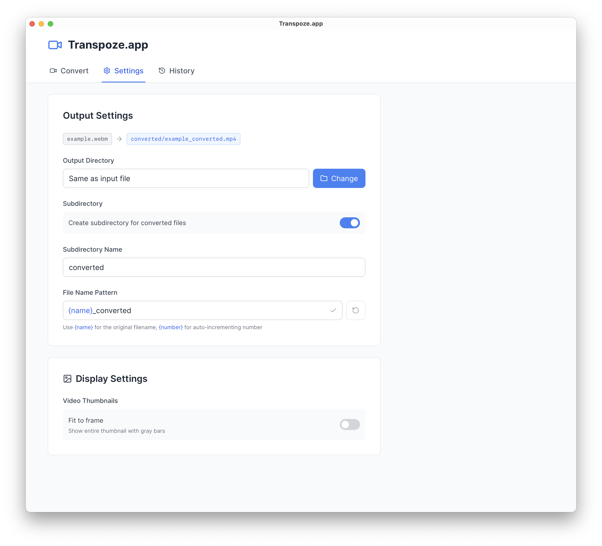

# Transvibe.app


> [!NOTE]
> This app was vibe-coded in a single redbull-fueled and kebab-refueled evening.
>
> Looking at the code may cause existential dread.
>
> Built with the 'useEffect until it works' pattern.

A fast, modern desktop app for transcoding WebM videos to MP4 format. Built with Tauri, React, and TypeScript.

## Screenshots

### Main Interface


*Drag and drop your WebM files and choose from optimized quality presets*

### Settings


*Customize output location, file naming patterns, and display preferences*

## Goal

An exploration of whether vibe-coding can lead to an unmanageable mess of spaghetti code. Apparently not achieved yet.

## Features

- 🎬 **Batch conversion**: Transcode multiple WebM files at once with drag-and-drop
- 🎯 **Quality Presets**: Choose from High, Balanced, Web, or Mobile quality settings
- 📊 **Progress Tracking**: Real-time conversion progress with queue management
- 🗂️ **Flexible Output**: Save to custom directory or alongside source files
- 📝 **Conversion History**: Track all your past transcoding jobs
- 🖼️ **Video Thumbnails**: Preview your videos before transcoding
- 🚀 **Native Performance**: Bundled FFmpeg for fast, dependency-free transcoding

## Download

**Note**: Releases are not available yet. The app is in development since yesterday.

Once available, you'll be able to download from the [Releases](https://github.com/dendotai/transvibe-app/releases) page.

### Platform Support

**macOS** (Currently supported):

- **Universal Binary**: Works on both Intel and Apple Silicon Macs
- **No dependencies**: FFmpeg is bundled with the app

**Linux** (Planned):

- Native .AppImage and .deb packages
- Bundled FFmpeg for distribution independence
- Support for major distributions (Ubuntu, Fedora, Arch)

**Windows** (Planned):

- Native .exe installer
- Bundled FFmpeg (no manual installation needed)
- Windows 10/11 support

## Usage

Coming soon:

- **macOS**: [Download for Mac](https://github.com/dendotai/transvibe-app/releases)
- **Linux**: [Download for Linux](https://github.com/dendotai/transvibe-app/releases)
- **Windows**: [Download for Windows](https://github.com/dendotai/transvibe-app/releases)

## Development

### Prerequisites

- Node.js 16+ and npm
- Rust 1.82+
- macOS, Linux, or Windows (currently macOS only; Linux/Windows support coming soon)
- jq (for FFmpeg download script): `brew install jq`

### Quick Start

1. **Clone the repository**

   ```bash
   git clone https://github.com/dendotai/transvibe-app.git
   cd transvibe-app
   ```

2. **Start developing**

   ```bash
   make setup   # One-time setup: install deps and download FFmpeg
   make dev     # Start the development server
   ```

That's it! The Makefile handles all the setup automatically.

#### Manual setup (if you prefer)

1. Install dependencies: `bun install`
2. Download FFmpeg: `./scripts/download-ffmpeg.sh`
3. Start development: `bun run tauri dev`

#### Available Make commands

```bash
make help            # Show all available commands
make setup           # Initial setup (install deps + download FFmpeg)
make desktop-dev     # Start desktop development server
make desktop-build   # Build the desktop application
make lint            # Run linters and fix issues
make type-check      # Run TypeScript type checking
make clean           # Clean build artifacts
```

### FFmpeg Version Management

The project uses a versioned FFmpeg setup:

- **Check current version**: Look at `scripts/ffmpeg-versions.json`
- **Download specific version**: `./scripts/download-ffmpeg.sh --version 7.0.2`
- **Force re-download**: `./scripts/download-ffmpeg.sh --force`
- **Version info**: Stored in `src-tauri/binaries/ffmpeg-version.json`

The FFmpeg version is tracked and displayed in the app's About dialog, making it easy to know which version is bundled with each release.

### Building

To build the application:

```bash
make build
```

Or manually: `bun run tauri build`

This creates:

- `.app` bundle in `src-tauri/target/release/bundle/macos/`
- `.dmg` installer in `src-tauri/target/release/bundle/dmg/`

## Technical Highlights

- **Smart Tooltips**: Custom edge-aware tooltips that never get clipped, built without external positioning libraries
- **Inline Autocomplete**: Cursor-style ghost text suggestions for filename variables - no dropdowns, just subtle hints
- **Zero Dependencies**: Bundled FFmpeg means users don't need to install anything
- **Architecture-Specific Builds**: Optimized binaries for both Intel and Apple Silicon

See [BRAGGING.md](BRAGGING.md) for more clever solutions we've implemented.

## Contributing

Please see [CONTRIBUTING.md](CONTRIBUTING.md) for guidelines on how to contribute to this project.

## Troubleshooting

### FFmpeg Download Issues

If the download script fails:

1. Check your internet connection
2. Ensure `jq` is installed: `brew install jq`
3. Try downloading a specific version: `./scripts/download-ffmpeg.sh --version 7.0.2`
4. Check [evermeet.cx](https://evermeet.cx/ffmpeg/) for available versions

### Build Issues

1. Ensure Rust 1.82+ is installed (check `rust-toolchain.toml`)
2. Clear build cache: `rm -rf src-tauri/target`
3. Reinstall dependencies: `rm -rf node_modules && npm install`

## License

This project is licensed under the MIT License - see the [LICENSE](LICENSE) file for details.

## Acknowledgments

- [FFmpeg](https://ffmpeg.org/) - The powerful multimedia framework
- [Tauri](https://tauri.app/) - For the amazing desktop app framework
- [evermeet.cx](https://evermeet.cx/ffmpeg/) - For providing macOS FFmpeg builds
